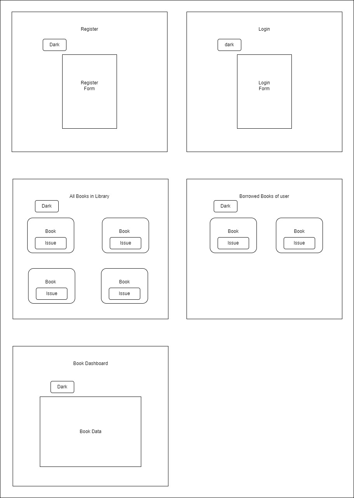
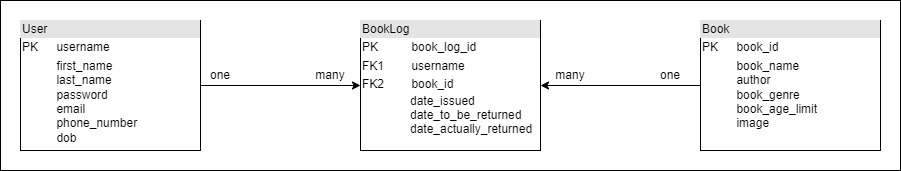

# Online Book Library Management Application

A web application for managing a library of books, with features for user authentication, viewing all books, viewing the borrowed books, managing the book database, and reviewing library logs.

## Technologies Used

- **Frontend**: React, TypeScript, Material UI
- **Backend**: Spring Boot
- **Database**: H2 Database
- **Authentication**: Session-based Authentication
- **Other Tools**: Axios for HTTP requests, React Router for navigation

## Features

- **User Authentication**: Users can register, log in and log out.
- **View All Books**: Browse a collection of available books.
- **Issue Books**: Users can borrow books, view borrowed books, and return books to the library.
- **Library Logs**: Admin users can view library activity logs.
- **Manage Books**: Admin users can view and manage the books, and new books to the Library, if needed.

## User Story


## Schema


## Setup Instructions
### Prerequisites
Before setting up the Online Book Library Management Application, ensure the following are installed on your system:

- **Node.j**s: Download and install Node.js.
- **Java JDK**: Install Java Development Kit (JDK) version 11 or above. You can download it from Oracle or OpenJDK.
- **Maven**: Install Apache Maven for managing the Spring Boot backend dependencies.
- **Git**: Install Git for version control. Download it from here.
- **IDE/Text Editor**: Use an IDE like IntelliJ IDEA for the backend and VS Code for the frontend.

### Installation
- **Clone the Respository**
```bash
git clone https://github.com/241209-JavaReactAWS/sharvani-rolando-sanjana-project1.git
```
- **Run Development Scripts**:
```bash
npm run dev
```
